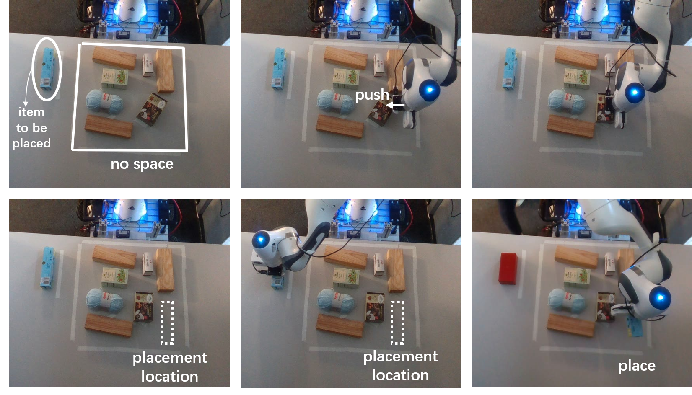

---

# Pushing Assisted Placing on a Tabletop


[](https://docs.omniverse.nvidia.com/app_isaacsim/app_isaacsim/overview.html)
[](https://isaac-orbit.github.io/orbit/source/setup/installation.html)
[](https://docs.python.org/3/whatsnew/3.7.html)
[](https://releases.ubuntu.com/20.04/)


In this project, we aim to train a pushing policy for a Franka Emika Panda arm to facilitate 2D dense object placement.
The network accepts a 2D Truncated Signed Distance Function (TSDF) and an occupancy grid of the desktop and outputs a pixel coordinate and a pushing direction for a pushing action to make space on the desktop. Models for this project are trained using Omniverse Isaac Sim 2022.2.1 and Isaac Orbit v0.1.0.




## Installation

Please refer the [Isaac Orbit documentation](https://isaac-orbit.github.io/orbit) to learn more about the installation of Isaac Sim and Isaac Orbit.We ran this code on Isaac Sim 2022.2.1. Therefore, to execute this code, please install Isaac Sim 2022.2.1 to ensure there are no compatibility issues.

When istalling Isaac Orbit, please clone the orbit repository here, instead of [official Isaac Orbit repository](https://github.com/NVIDIA-Omniverse/orbit). After setting up the environment following the [link](https://isaac-orbit.github.io/orbit), please install open3d, opencv-python, shapely in the created virtual environment.


## Trained Models

The trained models for this project can be downloaded from [trained models](https://drive.google.com/drive/folders/1P5K97kQskJ9YJLv1fqWs48eTtYFPR0Nr?usp=drive_link).

## Network Training and Performance Visualization for Pushing
To visualize the performance of the placing method, please run:
```

```

To visualize the performance of the pushing baseline method, please run:

```
./orbit.sh -p source/standalone/workflows/baseline/play.py --num_envs 1 --task Isaac-Push-50-baseline-Franka-v0
```


To train the framework of the PPO with CNN method, please run:

```
./orbit.sh -p source/standalone/workflows/sb3_customized/train.py --num_envs 1 --task Isaac-Push-50-PPO-Franka-v0 --headless 
 --save_path ./logs/ # save_path indicates the path of the directory to save the trained weight
```

To visualize the performance of the trained model of the PPO with CNN method, please run:

```
./orbit.sh -p source/standalone/workflows/sb3_customized/play.py --num_envs 1 --task Isaac-Push-50-PPO-val-Franka-v0 --checkpoint ./path # checkpoint indicates the path to the trained model

```


To train the framework of the DQN with FCN method without mask, please run:

```
./orbit.sh -p source/standalone/workflows/FCN_method/FCN_without_mask/train.py --num_envs 1 --task Isaac-Push-50-FCN-without-mask-train-Franka-v0  --headless --save_path ./logs/ # save_path indicates the path of the directory to save the trained weight
```


To visualize the performance of the trained model of the DQN with FCN method without mask, please run:

```
./orbit.sh -p source/standalone/workflows/FCN_method/FCN_without_mask/play.py --num_envs 1 --task Isaac-Push-50-FCN-val-Franka-v0 --checkpoint ./path # checkpoint indicates the path to the trained model weight
```

To train the framework of the DQN with FCN method with mask, please run:

```
./orbit.sh -p source/standalone/workflows/FCN_method/FCN_with_mask/train.py --num_envs 1 --task Isaac-Push-50-FCN-with-mask-train-Franka-v0 --headless --save_path ./logs/ # save_path indicates the path of the directory to save the trained weight
```


To visualize the performance of the trained model of the DQN with FCN method with mask, please run:

```
./orbit.sh -p source/standalone/workflows/FCN_method/FCN_with_mask/play.py --num_envs 1 --task Isaac-Push-50-FCN-val-Franka-v0 --checkpoint ./path # checkpoint indicates the path to the trained model weight
```

## Data Generation & Placing

To generate clutter table scenes or visualize the proposed placing method, please run:
```
./orbit.sh -p source/standalone/thesis/generate_cluttered_scene.py --headless ##to vusialize the placing performance please run the code without '--healess'
```

